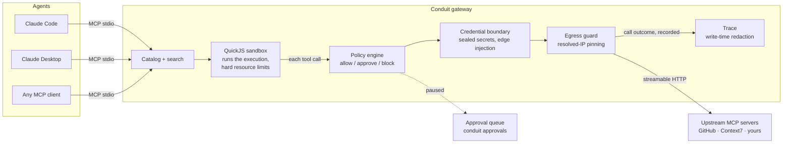

# Conduit

**One catalog for every tool. Guardrails on every call.**

Conduit is the open-source integration layer for AI agents. Configure each
integration once — MCP servers today, with authentication and per-tool
policies — and every MCP-compatible agent you use shares that same catalog
through one gateway, where the same guardrails apply to every call.

[Spec](conduitspec.md) · [Contributing](CONTRIBUTING.md) ·
[Security policy](SECURITY.md) · [License](LICENSE)

## Why Conduit

Most agent setups force a choice between locked-down-and-useless and
wide-open-and-risky:

- Every agent (Claude Code, Claude Desktop, Cursor, …) gets its own copy of
  every MCP server, its own copy of your credentials, and its own config to
  keep in sync.
- Tokens sit in plaintext JSON config files that any process can read.
- A tool call either happens or it doesn't — there's no policy between
  "the agent wants to" and "it ran", no approval step, and no audit trail
  afterward.

Conduit dissolves that dichotomy. Add a tool once, seal its credential once,
set its policy once — then every agent shares it over MCP. Secrets are
injected at the gateway edge and never reach the agent, the model, or
agent-authored code. Risky calls pause for your approval. Everything is
traced. **The whole idea: make the safe path the easy path.**

## How it works



Agents see a deliberately small MCP surface: search the catalog, execute a
tool. Progressive disclosure keeps a 40-tool upstream from flooding an
agent's context. Execution runs inside the sandbox; every tool call it
makes crosses the policy engine, the credential boundary, and the egress
guard on its way out, and its outcome is recorded in the trace.

## Quick start

Not yet on npm — run from source (Node version in [`.nvmrc`](.nvmrc), pnpm):

```bash
git clone https://github.com/nischal94/conduit-HQ.git && cd conduit-HQ
pnpm install --frozen-lockfile --ignore-scripts
pnpm -r build
alias conduit="node $PWD/packages/cli/dist/bin.js"
```

**1. Mint a master key** (stored at `~/.conduit/master-key`, mode 0600 — it
seals every credential in the store):

```bash
conduit key generate
```

**2. Onboard an upstream MCP server.** The optional credential travels via
env var — never a flag, so it stays out of argv and shell history — and is
SecretBox-encrypted at rest:

```bash
CONDUIT_ADD_SECRET=YOUR_TOKEN conduit add-mcp \
  --url https://api.githubcopilot.com/mcp/ \
  --namespace github --prefix github.personal
```

`add-mcp` fetches the upstream's tool list first and writes nothing unless
that succeeds, then reports a count per risk class with the fail-closed
policy defaults: `safe (auto-allow) · review (approval) · destructive
(approval)`.

**3. Point any MCP client at the gateway.** For Claude Code:

```bash
claude mcp add --scope user conduit -- node ABS_PATH/packages/cli/dist/bin.js serve
```

or in a client's JSON config:

```json
{
  "mcpServers": {
    "conduit": {
      "command": "node",
      "args": ["ABS_PATH/packages/cli/dist/bin.js", "serve"]
    }
  }
}
```

No key in the config: the server resolves it from `~/.conduit/master-key`.

**4. Approve what asks for approval.** When a call pauses, the agent is told
it's waiting; you decide from your terminal:

```bash
conduit approvals list              # oldest-first queue: id · tool · waiting-since · expiry
conduit approvals approve EXEC_ID   # or: deny EXEC_ID
```

Verified live against real upstreams (2026-08-03 dogfood run, recorded in
[`HANDOFF.md`](HANDOFF.md)): GitHub's MCP surface (44 tools) and Context7,
end to end through the boundary with a sealed credential.

## What's enforced (not promised)

Every load-bearing security claim in the [spec](conduitspec.md) is pinned by
an invariant test, tracked in [`INVARIANTS.md`](INVARIANTS.md) — a module
implementing a spec invariant does not land without its test in the same
commit.

| Guarantee | Mechanism | Spec |
| --- | --- | --- |
| Secrets never reach the agent, the model, or agent code | Sealed at rest (SecretBox), injected only at the gateway edge, request-scoped | §9.2 |
| No SSRF via upstream URLs | Fail-closed egress: resolve once, check the resolved IP, pin the connection | §9.3 |
| Policy between intent and execution | Per-tool allow / require-approval / block; approval queue with TTL and conflict semantics | §10 |
| Agent code can't take the host down | QuickJS sandbox with hard memory/stack/time limits, overflow-poisoning recovery | §16 |
| Auditable after the fact, day one | Every execution and tool call traced, secrets redacted at write time | §11 |
| One logical op, one budget | Deadline + cumulative byte cap across handshake, pagination, and call | §18-C4 |

## CLI reference

| Command | What it does |
| --- | --- |
| `conduit serve` | Run the stdio MCP gateway (same startup as the `conduit-mcp` bin) |
| `conduit add-mcp` | Onboard or re-sync an upstream MCP source (`--replace` to retarget, `--clear-credential` to deauth) |
| `conduit approvals list` | Show the pending approval queue |
| `conduit approvals approve\|deny EXEC_ID` | Decide a paused call; exit codes track the decision |
| `conduit key generate` | Mint the master key (refuses to overwrite) |
| `conduit key rotate` | Rotate the key and re-seal every credential in one transaction, with crash recovery |

Full flag reference and recovery procedures: [`packages/cli/README.md`](packages/cli/README.md).

## Project layout

| Path | What it is |
| --- | --- |
| [`packages/sdk`](packages/sdk) | Core: store + sealing, policy engine, QuickJS sandbox, execution pipeline, MCP upstream client |
| [`packages/mcp`](packages/mcp) | The stdio MCP server (`conduit serve`) |
| [`packages/cli`](packages/cli) | The `conduit` command |
| [`conduitspec.html`](conduitspec.html) / [`.md`](conduitspec.md) | The technical spec — the repo's source of truth (HTML is canonical; `.md` is generated) |
| [`INVARIANTS.md`](INVARIANTS.md) | Ledger mapping spec claims to their pinned tests |
| [`HANDOFF.md`](HANDOFF.md) / [`LEARNINGS.md`](LEARNINGS.md) | The live build-in-the-open session log and lessons ledger |

## Develop locally

```bash
pnpm install --frozen-lockfile --ignore-scripts   # build scripts are default-deny
pnpm -r build
pnpm -r test          # sdk 444 · mcp 56 · cli 105
pnpm lint && pnpm typecheck
```

CI runs the same five checks required on `main`. Dependency policy, commit
conventions, and the review pipeline: [CONTRIBUTING.md](CONTRIBUTING.md).

## Status & roadmap

Pre-1.0. The MVP core (catalog, policy, sandbox, boundary, trace, real
streamable-HTTP upstreams) is built and dogfooded daily as the credential
boundary for the maintainer's own agents. The v1 surface sequence (spec
§17): credential key lifecycle ✅ → daemon ownership → control API →
request-authenticity floor → console → trace viewer → service lifecycle.
OAuth-class upstreams are deliberately out of scope for v1.

## Built in the open

This repo is developed AI-agent-first under an unusually strict pipeline:
spec-recorded decisions, invariant-pinned security claims, multi-model
adversarial review with a written convergence criterion, and a human who
owns every merge. [`HANDOFF.md`](HANDOFF.md) and
[`LEARNINGS.md`](LEARNINGS.md) are the unedited working record — public on
purpose.

## Security

Conduit is a credential boundary; treat its bugs accordingly. Report
vulnerabilities privately per [SECURITY.md](SECURITY.md) — never a public
issue.

## License

[Apache-2.0](LICENSE).
